# Daily Quran

Android Quran reader built with Jetpack Compose and Material 3. Ships all 604 Mushaf Madinah pages, an offline ayah-coordinate database for tap-to-highlight, twelve reciters for streaming or cached playback, and the full quran.com translations catalogue.

[](https://github.com/Bsraccc1/daily-quran/actions/workflows/build.yml)
[](https://github.com/Bsraccc1/daily-quran/releases/latest)
[](https://www.android.com/)
[](https://kotlinlang.org/)
[](https://developer.android.com/jetpack/compose)
[](https://m3.material.io/)
[](https://developer.android.com/about/versions/lollipop)

---

## To do

- New Quran layout type (single-page vs dual-page spread)
- Update screenshot previews in this README

## Known bugs

- Audio download interface: tapping "Browse Surah" blocks subsequent taps on "Settings" until the panel is dismissed

## Screenshots

> Captures below are from v3.0.x. The v9.0 layout replaces frosted-glass panels with solid translucent surfaces and adds the vertical translation slider. Updated screenshots will ship with the next tagged release.

### Mushaf Reader

| Page 1 — Al-Fatihah (light) | Page 2 — Al-Baqarah (light) | Page 1 — Dark mode |
| --- | --- | --- |
| 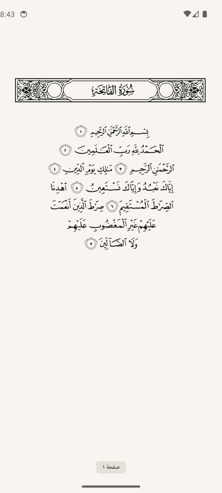 | 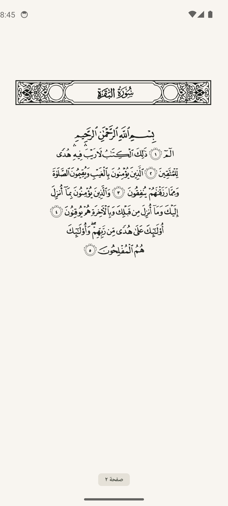 | 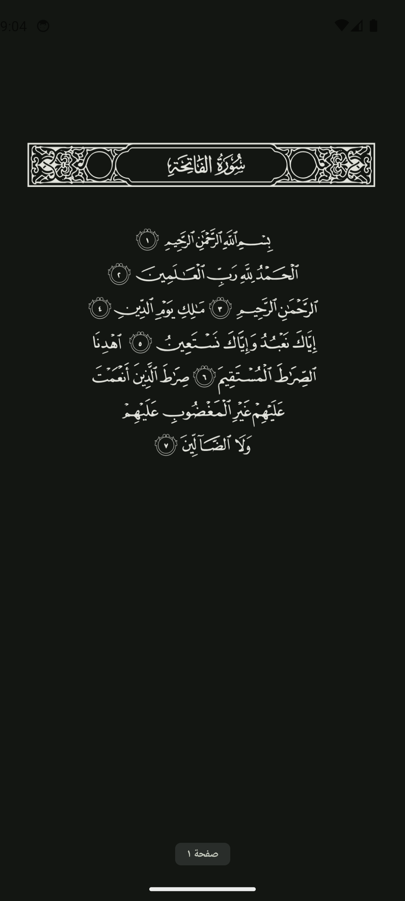 |

The Mushaf renderer uses bundled transparent-background WebP images tinted at runtime, so the calligraphy follows the active theme without any "white card" flashing in dark mode. Landscape rotation triggers a 1.18× zoom so the calligraphy fills the wider viewport.

### Reader chrome

Single-tap a page to reveal the floating control bar — back, translation, audio playback, memorize, **orientation lock**, and bookmark. Tapping a verse reveals the swipe-down panel with the verse context and two distinct **Surah & Ayah** / **Page** jump buttons.

| Light info panel | Dark info panel |
| --- | --- |
| 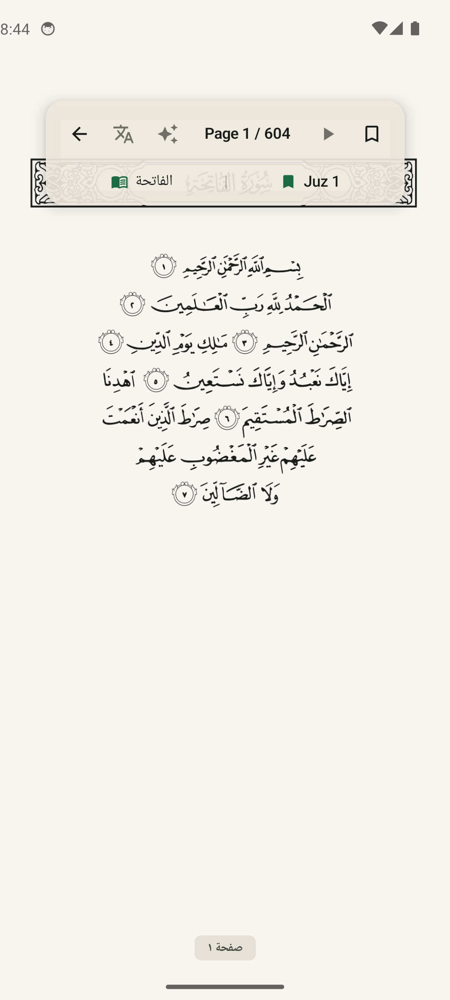 | 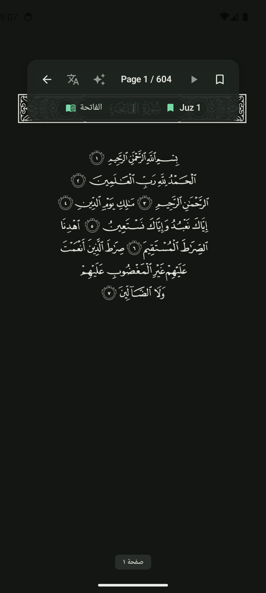 |

### Translation panel

Tapping the translate button slides up a 45%-of-screen panel with the chosen edition's translation. The header chip flips between **Single** (just the highlighted ayah) and **Page** (every translated ayah on the current page, with the highlighted row accented). Tapping the edition chip opens the catalogue picker — pulled live from quran.com's `/api/v4/resources/translations` — where you can download, switch between, and delete editions.

### Navigation tabs

| Reading dashboard | Juz / Surah / Hizb | Sessions | Bookmarks | Settings |
| --- | --- | --- | --- | --- |
| 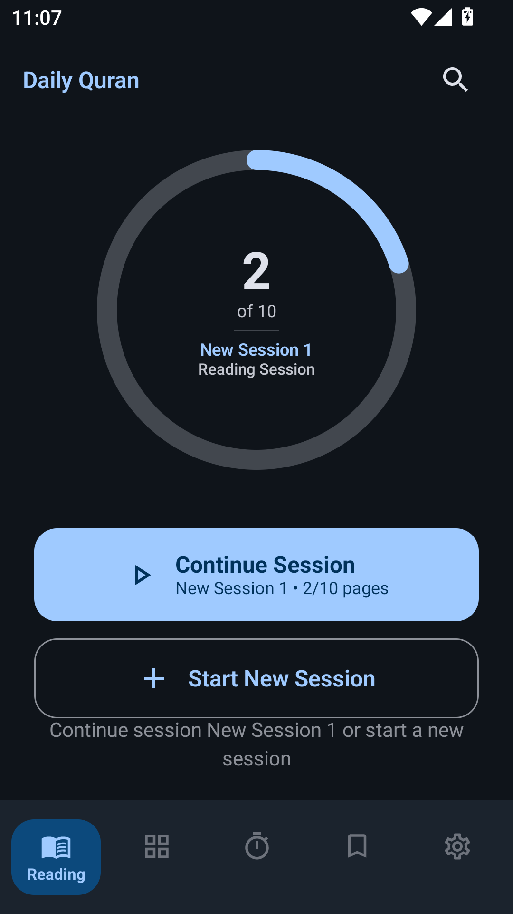 | 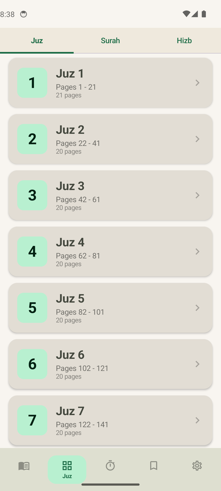 | 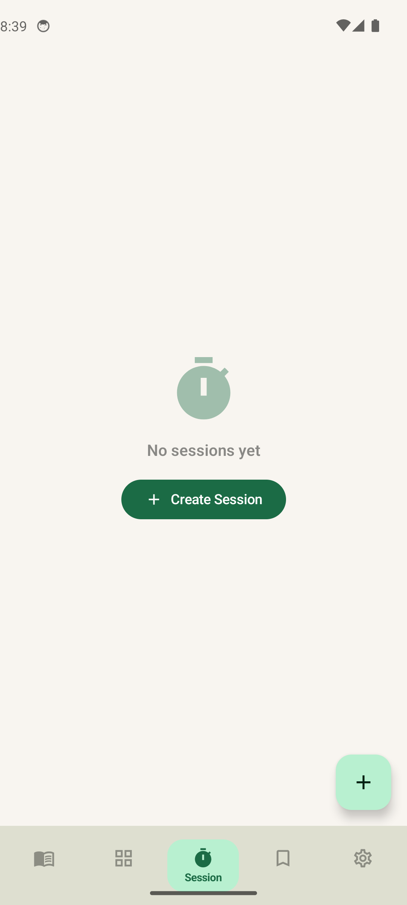 | 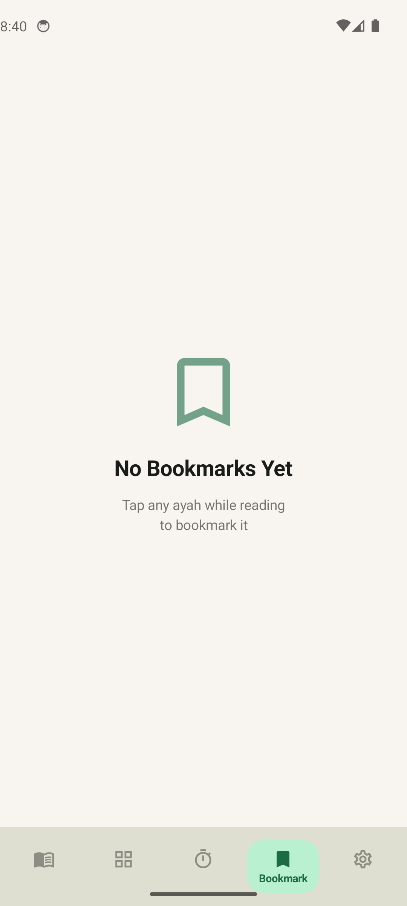 | 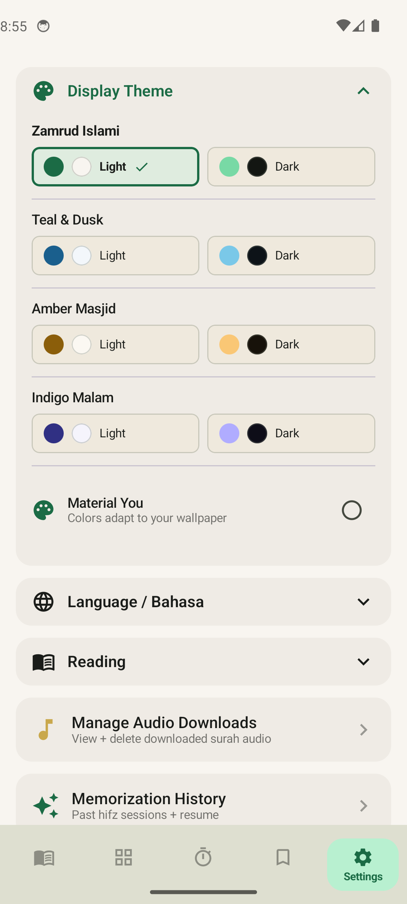 |

### Theme picker and search

| Theme picker (dark) | Search |
| --- | --- |
| 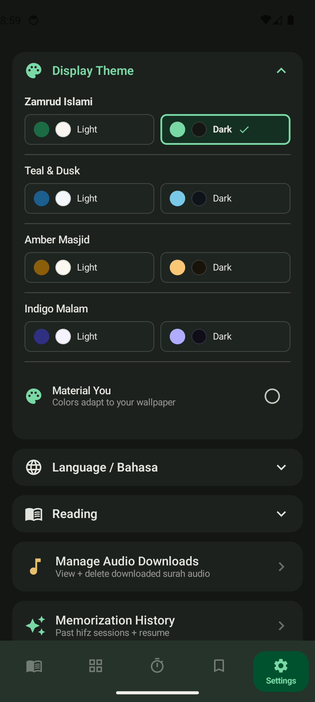 | 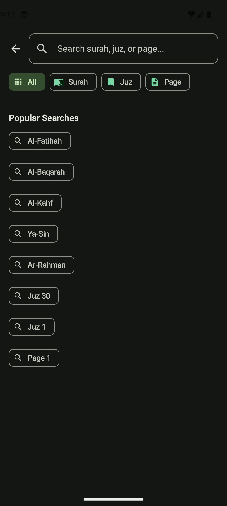 |

---

## Features

- **Offline Mushaf reader** — 604 Madinah pages bundled as transparent WebP, ~53 MB, tinted with the active Material 3 colour scheme.
- **Tap-to-highlight ayah** — long-press anywhere on a page to highlight the matching ayah using the bundled `ayahinfo.db` glyph rectangles.
- **Vertical translation panel** — slides up to 45% of the screen instead of covering the page; toggle between Single (highlighted only) and Page (all verses on the page).
- **Quran.com translations catalogue** — live-fetched picker with ~140 editions (Sahih International, Pickthall, Yusuf Ali, Hilali-Khan, Indonesian Ministry, Tafhim, Mubarakpuri, …); download / switch / delete per edition.
- **Twelve recitations** — Abdul Basit (Murattal + Mujawwad), Mishary Alafasy, Sudais, Shuraim, Husary, Minshawi, Maher Al-Muaiqly, Saad Al-Ghamdi, Ajamy, Hudhaify, Bukhatir, all with verified everyayah audio + quran.com per-ayah timing sync where available.
- **Reading sessions** — pick a Page range *or* an entire Juz from the dashboard; track progress, finish, or extend on the Sessions tab.
- **Reader navigation chrome** — distinct **Surah & Ayah** vs **Page** jump buttons in the swipe-down panel; orientation toggle (Auto / Portrait / Landscape) in the swipe-up panel.
- **Landscape mode** — the reader honours device rotation (no manifest portrait lock) and zooms the mushaf 1.18× to fill the wider viewport. Every other tab stays portrait.
- **Bookmarks** — per-ayah and per-page bookmarks with optional notes; one-tap toggle from the reader info panel.
- **Three navigation tabs** — Juz (30), Surah (114) with Makki/Madani classification, and Hizb (60).
- **Streaming recitation** — Media3 ExoPlayer with on-disk cache (`SimpleCache` + `CacheDataSource`), per-surah download manager, ayah-level highlight sync from the quran.com timing API.
- **Memorization (Hifz) mode** — overlay with repeat targets (3 / 5 / 10 / 20), persisted history, looping playback through the dedicated ExoPlayer.
- **Five themes** — Zamrud Islami, Teal & Dusk, Amber Masjid, Indigo Malam, and Material You (Android 12+), each with light and dark variants.
- **Session complete splash** — full-screen overlay with Gaussian blur backdrop (GPU `RenderEffect` on API 31+, software box blur on older devices), adaptive layout for portrait and landscape.
- **Auto-save** — periodic auto-save of reading progress with a floating indicator; session state survives process death via DataStore.
- **Bilingual UI** — English and Bahasa Indonesia, switchable from Settings.
- **Home-screen widget** — `QuranWidgetProvider` shows reading progress at a glance.
- **CI/CD** — GitHub Actions builds every push, publishes tagged releases with APK to [Releases](https://github.com/Bsraccc1/daily-quran/releases).

---

## Tech stack

| Layer | Library |
| --- | --- |
| Language | Kotlin (100%) |
| UI | Jetpack Compose, Material 3, `material3-window-size-class` |
| Architecture | MVVM + repositories, Hilt DI |
| Local data | Room v8 (bookmarks, ayah coordinates, translations, audio downloads, ayah timings, memorization sessions) |
| Bundled DB | `ayahinfo.db` (per-glyph rectangles for tap detection), 1024×1656 reference image space |
| Async | Kotlin Coroutines + Flow |
| Storage | DataStore Preferences |
| Networking | Retrofit + OkHttp |
| Image loading | Coil 2.5 |
| Audio | Media3 ExoPlayer 1.3.1 with `media3-datasource` cache |
| Background | WorkManager + Hilt Work |
| Min / target SDK | 21 / 34 |

---

## Project layout

```
app/src/main/
├── assets/
│   ├── mushaf_pages/            # 604 transparent WebP pages
│   ├── quran_data/ayahinfo.db   # per-glyph pixel rectangles
│   ├── word_alignment.db        # word-level alignment for highlight sync
│   └── *.otf / *.ttf            # Uthmanic Hafs, Uthman Naskh, Kitab, OpenDyslexic
├── java/com/quranreader/custom/
│   ├── data/
│   │   ├── audio/               # Media3 service, cache, timing API, sync engine
│   │   ├── local/               # Room DB, DAOs, ayahinfo DB wrapper
│   │   ├── memorization/        # hifz repository + DAO
│   │   ├── model/               # Bookmark, AyahCoordinate, TranslationText, …
│   │   ├── preferences/         # DataStore + Language enum
│   │   ├── reminder/            # DailyVerseWorker
│   │   ├── repository/          # QuranRepository, BookmarkRepository, TranslationRepository
│   │   └── widget/              # QuranWidgetProvider
│   ├── di/                      # AppModule, AyahInfoModule
│   ├── ui/
│   │   ├── components/
│   │   │   ├── animated/        # AnimatedCard, ChipRow, ExpandableSection, …
│   │   │   └── mushaf/          # MushafImageRenderer, MushafColorTheme, MushafFonts
│   │   ├── navigation/NavGraph.kt
│   │   ├── screens/             # bookmarks, downloads, home, juz, memorization,
│   │   │                        # onboarding, reading, search, session, settings
│   │   ├── theme/               # Color, Type, Theme, Dimensions, Motion
│   │   └── viewmodel/           # 11 ViewModels
│   ├── util/ + utils/           # ViewModelExtensions, LocaleManager
│   └── QuranReaderApp.kt        # @HiltAndroidApp, applies saved locale
└── res/                         # strings (en, in), drawable, font, layout, xml
tools/
├── build_mushaf_pages.py        # one-off pipeline to fetch + encode page WebPs
└── build_quran_db.py            # legacy text DB builder (kept for reference)
```

---

## Build

Requirements: Android SDK 34, JDK 17, Gradle wrapper bundled.

### Local Build

```bash
# Debug APK
./gradlew assembleDebug

# Release APK (R8 enabled)
./gradlew assembleRelease

# Install on connected device / emulator
./gradlew installDebug
```

Common dev commands:

```bash
./gradlew clean                  # remove build outputs
./gradlew :app:lint              # Android lint
./gradlew test                   # JVM unit tests
./gradlew connectedAndroidTest   # instrumented tests on a device
```

### CI/CD & Releases

The project uses GitHub Actions for automated builds and releases:

- **Continuous Build**: Every push to `main` or `develop` triggers lint, tests, and debug APK build
- **Automated Releases**: Pushing a version tag (e.g., `v9.3.0`) automatically builds and uploads APKs to GitHub Releases

#### Creating a Release

**Option 1: Using Script (Recommended)**

Windows (PowerShell):
```powershell
.\scripts\create-release.ps1
```

Linux/Mac (Bash):
```bash
chmod +x scripts/create-release.sh
./scripts/create-release.sh
```

The script will:
1. Prompt for new version number
2. Update `versionName` and `versionCode` in `build.gradle.kts`
3. Commit and push changes
4. Create and push version tag
5. Trigger GitHub Actions to build and release

**Option 2: Manual**

```bash
# 1. Update version in app/build.gradle.kts
# 2. Commit changes
git add app/build.gradle.kts
git commit -m "Bump version to 9.3.0"
git push origin main

# 3. Create and push tag
git tag -a v9.3.0 -m "Release version 9.3.0"
git push origin v9.3.0
```

GitHub Actions will automatically build and upload APKs to: https://github.com/Bsraccc1/daily-quran/releases

See [scripts/README.md](scripts/README.md) for detailed documentation.

The mushaf page assets and `ayahinfo.db` are committed to the repo, so a fresh clone builds and runs without any extra download step.

---

## How it works

### Mushaf rendering

`MushafImageRenderer` lays out a `BoxWithConstraints` whose aspect ratio matches the source image (1024×1656). The page is loaded with Coil's `AsyncImage`, drawn with `ContentScale.FillBounds`, and tinted via `ColorFilter.tint(theme.text, BlendMode.SrcIn)`. Because the image is alpha-only (transparent background, ink in the alpha channel), `SrcIn` paints the calligraphy in the theme's text colour over a `theme.background`-coloured `Box`.

`MushafImagePageViewModel` queries the bundled `ayahinfo.db` (Room's `createFromAsset`) for the page's `GlyphEntity` rows. On long press, `hitTest` divides the touch offset by the runtime scale factors and returns the first glyph whose pixel rectangle contains the point — that surfaces the ayah's `(surah, ayah)` to the parent screen, which then shows the translation sheet or audio popup.

When audio is playing, the highlight switches to an audio-driven `HighlightedAyah` (computed from `currentAudioAyah`), so the highlighted line follows the recitation rather than the last tap.

### Reading sessions

`ReadingViewModel` owns a single `SessionState` machine (`IDLE`, `INPUT_PENDING`, `ACTIVE`, `COMPLETE`) persisted in DataStore so the dashboard can resume the active session across launches. When `pagesReadInSession >= sessionTargetPages`, the reader shows a full-screen `SessionCompleteSplash` overlay with a Gaussian blur backdrop, reading stats, and continue/close actions. The blur uses GPU `RenderEffect` on API 31+ and a software two-pass box blur on older devices.

### Audio

`AudioService` is a Media3 `MediaSessionService` that builds an `ExoPlayer` whose `MediaSourceFactory` is wrapped by `AudioCacheManager` (a `CacheDataSource.Factory` over a `SimpleCache` rooted at `cacheDir/audio`). Surah downloads pre-warm the same cache through `AudioDownloadWorker`, so an offline-cached surah plays back immediately with no network hit.

`HighlightSyncEngine` polls the player's position and emits the active `AyahKey` based on `AyahTimingRepository` rows fetched from the quran.com timing API and persisted in Room.

---

## Permissions

Declared in `AndroidManifest.xml`:

- `INTERNET`, `ACCESS_NETWORK_STATE`, `ACCESS_WIFI_STATE` — translation download, audio streaming, timing API
- `WAKE_LOCK`, `FOREGROUND_SERVICE`, `FOREGROUND_SERVICE_MEDIA_PLAYBACK` — Media3 audio service
- `FOREGROUND_SERVICE_DATA_SYNC` — WorkManager surah downloads
- `POST_NOTIFICATIONS` — playback + download progress (Android 13+)
- `READ_MEDIA_AUDIO` — playing locally cached recitations on Android 13+
- `MODIFY_AUDIO_SETTINGS`, `VIBRATE`, `REQUEST_IGNORE_BATTERY_OPTIMIZATIONS` — playback polish

The app does not request location, contacts, camera, or any analytics SDK permissions.

---

## License

MIT — see [LICENSE](LICENSE).

The Mushaf Madinah page images and the `ayahinfo.db` glyph database are derived from publicly available [Quran.com](https://quran.com) / [quran_android](https://github.com/quran/quran_android) assets. Recitation audio is streamed from the [QuranicAudio](https://quranicaudio.com/) and [everyayah.com](https://everyayah.com/) CDNs.
